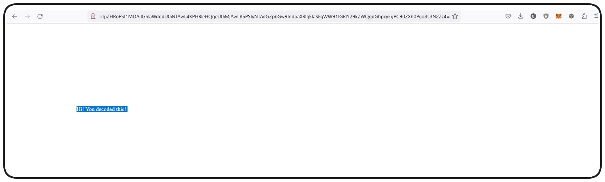

# Nft

Non-fungible Tokens (NFTs) are a product of the **[ERC721 Token Standard](https://eips.ethereum.org/EIPS/eip-721)**, created on Ethereum.

Non-fungible: This means they are explicitly unique from one another and one NFT cannot be interchanged with another.

## What's an NFT do?
1. NFTs have been widely adopted as a medium for art and a means to trade and collect digital art.
2. Some protocol turn them into representations of game assets, or into tradable metaverse items, sometimes they're used as means to keep record, or grant access to services or events.

Nfts can be can be viewed, bought and sold on marketplaces such as **[OpenSea](https://opensea.io/)** and **[Rarible](https://rarible.com/)**

## ERC721 Standard (NFTs)
How do ERC721 differ from ERC20 fundamentally:  

1. **Ownership:**
ERC20s handle ownership via a simple mapping of a uint256 token balance to an address.  

ERC721s, by contrast, each have a unique tokenId, these tokenIds are mapped to a user's address. In addition to a tokenId, ERC721s include a tokenUri, a tokenUri details the unique properties of that token, stats, images etc.

2. **Fungibility:**
NFTs are _non-fungible_. This means each token is unique and cannot be interchanged with another. ERC20s, on the other hand, are _fungible_. Any LINK token is identical in property and value to any other LINK token.

## How NFTs are Unique?
The uniqueness of an NFT token is demonstrated by it's unique tokenId as well as it's metadata/tokenUri. This is a property of an NFT which details the attributes of that token. You can imagine a character in a game, the tokenUri would be their stats page and all the details that make them an individual.

Gas costs on ethereum make the storage of large amounts of data (like images), on-chain, prohibitively expensive in most cases.  

The solution to this was the inclusion of the tokenUri within the ERC721 Standard. This serves as a property of a token which details what the asset looks like as well as any attributes associated with it. A basic tokenUri looks something like:  
```json
{
    "name": "Name",
    "description": "Description",
    "image": "ImageURI",
    "attributes": []
}
```
Even this can serve to be pretty expensive, so there's a constant discuss about on-chain vs off-chain metadata. Off-chain solutions obviously come with all the pitfalls of centralization that we would expect (including losing record of what your NFT is), but the easy and savings associated with avoiding deploying this extra data are pretty appealing.
Often a protocol will use a service like **[IPFS](https://ipfs.tech/)** to hedge their bets a little bit in a more decentralized method of storage, but it too comes with its own pros and cons.

To take this consideration even further, oftentimes marketplaces won't have a means to recognize on-chain metadata since they're _so_ used to looking for a tokenUri.

In General:

* Upload NFT Image to IPFS

* Create metadata point to that image

* Set the NFTs tokenUri to point to that metadata

### TokenURI
TokenURI stands for Token Uniform Resource Identifier. At its core it serves as an endpoint that returns the metadata for a given NFT.  
```json
{
    "title": "Asset Metadata",
    "type": "object",
    "properties": {
        "name": {
            "type": "string",
            "description": "Identifies the asset to which this NFT represents"
        },
        "description": {
            "type": "string",
            "description": "Describes the asset to which this NFT represents"
        },
        "image": {
            "type": "string",
            "description": "A URI pointing to a resource with mime type image/* representing the asset to which this NFT represents. Consider making any images at a width between 320 and 1080 pixels and aspect ratio between 1.91:1 and 4:5 inclusive."
        }
    }
}
```
It's this metadata that defines what the properties of the NFT are, including what it looks like! In fact, if you go to **[OpenSea](https://opensea.io/)** and look at any NFT there, all the data and images you're being served come from calls to the tokenURI function.

What this means to us is - any time someone mints a Doggie NFT, we need to assign a TokenURI to the minted TokenID which contains all the important information about the Doggie.
> ❗ **NOTE**
> The OpenZeppelin implementation of ERC721, which we've imported, has it's own virtual tokenURI function which we can overriding.  

By navigating to any NFT on OpenSea, you can find a link to the collection's contract on Etherscan. Click on `Read Contract` and find the tokenURI function (here's a link to **[Pudgy Penguins](https://etherscan.io/address/0xbd3531da5cf5857e7cfaa92426877b022e612cf8#readContract)** if you need it).
Entering any valid tokenId should return the TokenURI of that NFT!

# IPFS
It all starts with the data we want hosted. This can be more or less anything, code, images, some other file, it doesn't matter. As we know, any data can be hashed and this is essentially what IPFS Node's do initially. We provide our data to the IPFS network via a Node and the output is a unique hash that points to the location and details of that data.    

Each IPFS Node is once part of a much larger network and each of them constantly communicates to distribute data throughout the network. Any given node can choose to pin particular pieces of data to host/persist on the network.
> ❗ **NOTE**
> IPFS isn't able to execute logic or perform computation, it only serves as a means of decentralized storage

What we would do then is upload our data to IPFS and then pin it in our node, assuring that the IPFS Hash of the data is available to anyone calling the network.  

Importantly, unlike a blockchain, where every node has a copy of the entire register, IPFS nodes can choose what they want to pin.  

### Using IPFS
There are a few ways to actually use IPFS including a CLI installation, a browser companion and even a dedicated desktop application.

Let's go ahead and **[install the IPFS Desktop application](https://docs.ipfs.tech/install/ipfs-desktop/)**. Once installed you should be able to open the application and navigate to a files section that looks like this:
  

> ❗ **IMPORTANT**
> Any data uploaded to this service will be _**public**_ by nature.  
  
  

Once a file is uploaded, you can click on that file and view that data.  

  

Alternatively, if you're having trouble viewing your data directly from the IPFS network you can use the IPFS Gateway. When using a gateway, you're not directly requesting the data from the IPFS Network, you're requesting through another server which makes the request on your behalf, so it brings to question centrality and things again.

You can typically find a gateway from the [public gateway checker.](https://ipfs.github.io/public-gateway-checker/)

## Again IPFS
We learnt previously that there are two ways to reference the location of data hosted by `IPFS`. We can point directly to the `IPFS` network with the syntax `ipfs://<CID>` _or_ we can use the `IPFS Gateway` and point to an IPFS server via `https://ipfs.io/ipfs/<CID>`.

There are some important considerations to keep in mind here. If we decide to use the `IPFS Gateway`, this is essentially pointing to a website hosted on a server by `IPFS`. If this website or server goes down for any reason the data we're pointing to will be unretrievable!

A safer methodology is pointing to the `IPFS` network directly, but this comes with caveats. While the URI is pointing to a decentralized network, assuring the data is accessible so long as a node is still hosting it, most browsers and services don't natively support interfacing with the `IPFS` network. This can make viewing and interacting with your NFT cumbersome.

In addition to the above, the `IPFS` network doesn't automatically distribute all data amongst all nodes on the network (like a blockchain would). Instead it relies on nodes pinning the data they find valuable to assure it's available to the rest of the network. If I'm the only person pinning my data on `IPFS`, I'm not any more decentralized than using the `IPFS Gateway`.

_**So, how do we solve this?**_

### Pinning Services

Fortunately, there are services available which developers can use to pin their data for them, decentralizing access to it. One such service is **[Pinata.cloud](https://www.pinata.cloud/)**.  

    

Once an account is created and you've logged in, the UI functions much like an `IPFS` node and you can simply upload any files you want the service to pin on your behalf.  

  

Once uploaded, `Pinata` will provide a `CID`, just like `IPFS` itself will.  

  

> ❗ **PROTIP**
> Whenever you work on a project, you should upload images/data both to local `IPFS` node as well as `Pinata` to assure the data is always pinned _somewhere_.

## SVGs
SVG stands for `Scalable Vector Graphics`. In 'simple' terms, SVG is a way to define images in a two-dimensional space using XML coded tags with specific parameters.

**Importance of SVGs**  

SVGs are awesome because they maintain their quality, no matter what size you make them. If you stretch a traditional image file like a .jpg or .png, they become pixelated and lose clarity. SVGs don’t suffer from this issue because they’re scalable. They’re defined within an exact parameter, thus maintaining their quality regardless of scale.  

[Demo](https://www.w3schools.com/graphics/tryit.asp?filename=trysvg_myfirst).  

> ❗ **IMPORTANT**
> You will likely need to download a SVG preview extension to view the SVG in your IDE. I recommend trying **[SVG Preview](https://marketplace.visualstudio.com/items?itemName=SimonSiefke.svg-preview)**.

Importantly, this SVG code _**is not**_ a URI, but we can convert this into a URI that a browser can understand by passing all the necessary data through the URL of our browser.

### Converting to URI
ensure that `base64` command is installed.  

run the following command to pass example.svg as a file to the base64 command:

```bash
base64 -i example.svg
```  
You should get an output like this (those without base64 can copy and paste this value):    

```bash
PHN2ZyB4bWxucz0iaHR0cDovL3d3dy53My5vcmcvMjAwMC9zdmciIHdpZHRoPSI1MDAiIGhlaWdodD0iNTAwIj4KPHRleHQgeD0iMjAwIiB5PSIyNTAiIGZpbGw9IndoaXRlIj5IaSEgWW91IGRlY29kZWQgdGhpcyEgPC90ZXh0Pgo8L3N2Zz4=
```  
This weird output is the base64 encoded example.svg. We can now add a prefix which tells our browser what type of data this is, `data:image/svg+xml,base64,`.

Copy this whole string into your browser and you should see our SVG!    

```bash
data:image/svg+xml;base64,PHN2ZyB4bWxucz0iaHR0cDovL3d3dy53My5vcmcvMjAwMC9zdmciIHdpZHRoPSI1MDAiIGhlaWdodD0iNTAwIj4KPHRleHQgeD0iMjAwIiB5PSIyNTAiIGZpbGw9IndoaXRlIj5IaSEgWW91IGRlY29kZWQgdGhpcyEgPC90ZXh0Pgo8L3N2Zz4=
```


This same process can be applied to happy and sad SVGs images for our NFTs. You can navigate to the **[GitHub Repo](https://github.com/AkshatOdiya/foundry-nft/tree/main/img)** to see the code which represents our happy and sad SVGs.

```bash
base64 -i happy.svg
PHN2ZyB2aWV3Qm94PSIwIDAgMjAwIDIwMCIgd2lkdGg9IjQwMCIgIGhlaWdodD0iNDAwIiB4bWxucz0iaHR0cDovL3d3dy53My5vcmcvMjAwMC9zdmciPgogIDxjaXJjbGUgY3g9IjEwMCIgY3k9IjEwMCIgZmlsbD0ieWVsbG93IiByPSI3OCIgc3Ryb2tlPSJibGFjayIgc3Ryb2tlLXdpZHRoPSIzIi8CiAgPGcgY2xhc3M9ImV5ZXMiPgogICAgPGNpcmNsZSBjeD0iNjEiIGN5PSI4MiIgcj0iMTIiLz4KICAgIDxjaXJjbGUgY3g9IjEyNyIgY3k9IjgyIiByPSIxMiIvPgogIDwvZz4KICA8cGF0aCBkPSJtMTM2LjgxIDExNi41M2MuNjkgMjYuMTctNjQuMTEgNDItODEuNTItLjczIiBzdHlsZT0iZmlsbDpub25lOyBzdHJva2U6IGJsYWNrOyBzdHJva2Utd2lkdGg6IDM7Ii8+Cjwvc3ZnPg==

base64 -i sad.svg
PHN2ZyB3aWR0aD0iMTAyNHB4IiBoZWlnaHQ9IjEwMjRweCIgdmlld0JveD0iMCAwIDEwMjQgMTAyNCIgeG1sbnM9Imh0dHA6Ly93d3cudzMub3JnLzIwMDAvc3ZnIj4KICA8cGF0aCBmaWxsPSIjMzMzIiBkPSJNNTEyIDY0QzI2NC42IDY0IDY0IDI2NC42IDY0IDUxMnMyMDAuNiA0NDggNDQ4IDQ0OCA0NDgtMjAwLjYgNDQ4LTQ0OFM3NTkuNCA2NCA1MTIgNjR6bTAgODIwYy0yMDUuNCAwLTM3Mi0xNjYuNi0zNzItMzcyczE2Ni42LTM3MiAzNzItMzcyIDM3MiAxNjYuNiAzNzIgMzcyLTE2Ni42IDM3Mi0zNzIgMzcyeiIvPgogIDxwYXRoIGZpbGw9IiNFNkU2RTYiIGQ9Ik01MTIgMTQwYy0yMDUuNCAwLTM3MiAxNjYuNi0zNzIgMzcyczE2Ni42IDM3MiAzNzIgMzcyIDM3Mi0xNjYuNiAzNzItMzcyLTE2Ni42LTM3Mi0zNzItMzcyek0yODggNDIxYTQ4LjAxIDQ4LjAxIDAgMCAxIDk2IDAgNDguMDEgNDguMDEgMCAwIDEtOTYgMHptMzc2IDI3MmgtNDguMWMtNC4yIDAtNy44LTMuMi04LjEtNy40QzYwNCA2MzYuMSA1NjIuNSA1OTcgNTEyIDU5N3MtOTIuMSAzOS4xLTk1LjggODguNmMtLjMgNC4yLTMuOSA3LjQtOC4xIDcuNEgzNjBhOCA4IDAgMCAxLTgtOC40YzQuNC04NC4zIDc0LjUtMTUxLjYgMTYwLTE1MS42czE1NS42IDY3LjMgMTYwIDE1MS42YTggOCAwIDAgMS04IDguNHptMjQtMjI0YTQ4LjAxIDQ4LjAxIDAgMCAxIDAtOTYgNDguMDEgNDguMDEgMCAwIDEgMCA5NnoiLz4KICA8cGF0aCBmaWxsPSIjMzMzIiBkPSJNMjg4IDQyMWE0OCA0OCAwIDEgMCA5NiAwIDQ4IDQ4IDAgMSAwLTk2IDB6bTIyNCAxMTJjLTg1LjUgMC0xNTUuNiA2Ny4zLTE2MCAxNTEuNmE4IDggMCAwIDAgOCA4LjRoNDguMWM0LjIgMCA3LjgtMy4yIDguMS03LjQgMy43LTQ5LjUgNDUuMy04OC42IDk1LjgtODguNnM5MiAzOS4xIDk1LjggODguNmMuMyA0LjIgMy45IDcuNCA4LjEgNy40SDY2NGE4IDggMCAwIDAgOC04LjRDNjY3LjYgNjAwLjMgNTk3LjUgNTMzIDUxMiA1MzN6bTEyOC0xMTJhNDggNDggMCAxIDAgOTYgMCA0OCA0OCAwIDEgMC05NiAweiIvPgo8L3N2Zz4=
```  

Append the prefix `data:image/svg+xml;base64,` and view the images in your browser to assure things are working as expected!

## Filecoin and Arweave
On-chain storage can be gas intensive, sometimes prohibitively so. Aware of additional options you could consider for decentralized storage in your projects. Two of the most popular options out there are `Filecoin` and `Arweave`.

1. **Arweave**

Arweave is a decentralized storage network that makes data immune to modification, ensuring data validity over very long periods. This is an ideal solution for anyone looking for a permanent database.

2. **Filecoin**

Providing reliable and cost-effective storage, Filecoin is a decentralized protocol that propels the open-market for data storage services.


Filecoin, since its launch in 2020, has been working tirelessly towards decentralizing the data infrastructure for the internet. Their layer one solution, Filecoin Virtual Machine (FVM), has launched some impressive functionalities.

* **Filecoin Data Deal Making:** It involves setting up an agreement between a client and a miner to store data.

* **Tokenization of Data Sets:** With tokenization, data can be protected securely and transparently.

* **Data DAOs:** Filecoin's on-chain tools allow data to be collectively owned and governed by an organization (DAO - Decentralized Autonomous Organization).  

See this video Detailing Filecoin and decentralized storage **[here](https://www.youtube.com/watch?v=Cj9r3pKI2L8)**

And many more use cases are being developed, showcased in the [Filecoin docs](https://docs.filecoin.io/).

To get started with Filecoin, try deploying a smart contract to FVM, or use the storage helper - **[Web3 Storage](https://web3.storage/)** or **[NFT Storage](https://nft.storage/)**, to engage with the technology directly.


---
# Advanced EVM - Opcodes, Calling, and Encoding

See the file [Encoding.sol](https://github.com/AkshatOdiya/foundry-nft/blob/main/sublesson_Advanced_EVM/Encoding.sol) for these  upcoming functions.

We've been using abi.encode and abi.encodePacked effectively as a means to concatenate strings (which has actually been deprecated in favour of string.concat).

Suppose a function:
```solidity
function combineStrings() public pure returns(string memory){
    return string(abi.encodePacked("Hi Mom! ", "Miss you!"));
}
```
If we just run abi.encodePacked _without_ converting to a string we get:  
```solidity
bytes: 0x4869204d6f6d21204d69737320796f7521
```
`abi.encodePacked` exists in Solidity as a **[globally available method](https://docs.soliditylang.org/en/latest/units-and-global-variables.html#abi-encoding-and-decoding-functions)**. Solidity actually has a whole bunch of these. You can use the **[Cheatsheet](https://docs.soliditylang.org/en/latest/cheatsheet.html)** made available in the Solidity documentation as a reference.

> ❗ **NOTE**
> Since Solidity v0.8.12, you no longer need to use abi.encodePacked to concatenate strings. The preferred method is via `string.concat(stringA, stringB)`

Before we dive deeper into what's happening when we call `encodePacked`, let's first investigate some of the finer details of sending a transaction.

### Compilation

When we compile using `forge build`, a JSON file is added to our `out` directory. This file contains a lot of data, but our purposes focus primarily on the abi and the bytecode.  


You can actually get this data right out of Remix.  navigate to the `Solidity Compiler` tab and click `Compilation Details`. This will provide a readout which includes the ABI and Bytecode for this contract!


The Bytecode object represents the binary that is actually being put on the blockchain, when we send a transaction.

When our transaction is a new deployment, the `to` parameter is left empty, but our `data` parameter is very important. The bytecode we send to the blockchain represents our `contract's initialization code` and the `contract itself`.

We can see this in Etherscan for any contract we've deployed. Here's an **[example deployment](https://sepolia.etherscan.io/tx/0x72d701257bd21f261294e47bb749ff28409aec5e7de64528c3d8d8cb220f4bb4)** of `BasicNFT.sol`. The input data you can see at the bottom (`show more details`) represents the binary data, the bytecode that we've been talking about. This data includes both the initialization of a contract as well as data representing the contract itself.  


**_How does the blockchain understand what to do with this bytecode?_**  

### Op Codes

Bytecode Example

```Solidity
0x60806040523480156200001157600080fd5b506040518060400160405280600881526020016710985cda58d3919560c21b8152506040518060400160405280600381526020016210919560ea1b815250816000908162000060919062000124565b5060016200006f828262000124565b5050600060065550620001f0565b634e487b7160e01b600052604160045260246000fd5b600181811c90821680620000a857607f821691505b602082108103620000c957634e487b7160e01b600052602260045260246000fd5b50919050565b601f8211156200011f576000816000526020600020601f850160051c81016020861015620000fa5750805b601f850160051c820191505b818110156200011b5782815560010162000106565b5050505b505050565b81516001600160401b038111156200014057620001406200007d565b620001588162000151845462000093565b84620000cf565b602080601f831160018114620001905760008415620001775750858301515b600019600386901b1c1916600185901b1785556200011b565b600085815260208120601f198616915b82811015620001c157888601518255948401946001909101908401620001a0565b5085821015620001e05787850151600019600388901b60f8161c191681555b5050505050600190811b01905550565b61133f80620002006000396000f3fe608060405234801561001057600080fd5b50600436106100ea5760003560e01c806370a082311161008c578063b88d4fde11610066578063b88d4fde146101e1578063c87b56dd146101f4578063e985e9c514610207578063fb37e8831461021a57600080fd5b806370a08231146101a557806395d89b41146101c6578063a22cb465146101ce57600080fd5b8063095ea7b3116100c8578063095ea7b31461015757806323b872dd1461016c57806342842e0e1461017f5780636352211e1461019257600080fd5b806301ffc9a7146100ef57806306fdde0314610117578063081812fc1461012c575b600080fd5b6101026100fd366004610d6d565b61022d565b60405190151581526020015b60405180910390f35b61011f61027f565b60405161010e9190610dd7565b61013f61013a366004610dea565b610311565b6040516001600160a01b03909116815260200161010e565b61016a610165366004610e1f565b610338565b005b61016a61017a366004610e49565b610452565b61016a61018d366004610e49565b610483565b61013f6101a0366004610dea565b61049e565b6101b86101b3366004610e85565b6104fe565b60405190815260200161010e565b61011f610584565b61016a6101dc366004610ea0565b610593565b61016a6101ef366004610f68565b6105a2565b61011f610202366004610dea565b6105da565b610102610215366004610fe4565b61067c565b6101b8610228366004611017565b6106aa565b60006001600160e01b031982166380ac58cd60e01b148061025e57506001600160e01b03198216635b5e139f60e01b145b8061027957506301ffc9a760e01b6001600160e01b03198316145b92915050565b60606000805461028e90611060565b80601f01602080910402602001604051908101604052809291908181526020018280546102ba90611060565b80156103075780601f106102dc57610100808354040283529160200191610307565b820191906000526020600020905b8154815290600101906020018083116102ea57829003601f168201915b5050505050905090565b600061031c826106ea565b506000908152600460205260409020546001600160a01b031690565b60006103438261049e565b9050806001600160a01b0316836001600160a01b0316036103b55760405162461bcd60e51b815260206004820152602160248201527f4552433732313a20617070726f76616c20746f2063757272656e74206f776e656044820152603960f91b60648201526084015b60405180910390fd5b336001600160a01b03821614806103d157506103d1813361067c565b6104435760405162461bcd60e51b815260206004820152603d60248201527f4552433732313a20617070726f76652063616c6c6572206973206e6f7420746f60448201527f6b656e206f776e6572206f7220617070726f76656420666f7220616c6c00000060648201526084016103ac565b61044d838361074c565b505050565b61045c33826107ba565b6104785760405162461bcd60e51b81526004016103ac9061109a565b61044d838383610819565b61044d838383604051806020016040528060008152506105a2565b6000818152600260205260408120546001600160a01b0316806102795760405162461bcd60e51b8152602060048201526018602482015277115490cdcc8c4e881a5b9d985b1a59081d1bdad95b88125160421b60448201526064016103ac565b60006001600160a01b0382166105685760405162461bcd60e51b815260206004820152602960248201527f4552433732313a2061646472657373207a65726f206973206e6f7420612076616044820152683634b21037bbb732b960b91b60648201526084016103ac565b506001600160a01b031660009081526003602052604090205490565b60606001805461028e90611060565b61059e33838361097d565b5050565b6105ac33836107ba565b6105c85760405162461bcd60e51b81526004016103ac9061109a565b6105d484848484610a4b565b50505050565b60008181526007602052604090208054606091906105f790611060565b80601f016020809104026020016040519081016040528092919081815260200182805461062390611060565b80156106705780601f1061064557610100808354040283529160200191610670565b820191906000526020600020905b81548152906001019060200180831161065357829003601f168201915b50505050509050919050565b6001600160a01b03918216600090815260056020908152604080832093909416825291909152205460ff1690565b60065460008181526007602052604081209091906106c88482611137565b506106d33382610a7e565b6006546106e19060016111f7565b60065592915050565b6000818152600260205260409020546001600160a01b03166107495760405162461bcd60e51b8152602060048201526018602482015277115490cdcc8c4e881a5b9d985b1a59081d1bdad95b88125160421b60448201526064016103ac565b50565b600081815260046020526040902080546001600160a01b0319166001600160a01b03841690811790915581906107818261049e565b6001600160a01b03167f8c5be1e5ebec7d5bd14f71427d1e84f3dd0314c0f7b2291e5b200ac8c7c3b92560405160405180910390a45050565b6000806107c68361049e565b9050806001600160a01b0316846001600160a01b031614806107ed57506107ed818561067c565b806108115750836001600160a01b031661080684610311565b6001600160a01b0316145b949350505050565b826001600160a01b031661082c8261049e565b6001600160a01b0316146108525760405162461bcd60e51b81526004016103ac90611218565b6001600160a01b0382166108b45760405162461bcd60e51b8152602060048201526024808201527f4552433732313a207472616e7366657220746f20746865207a65726f206164646044820152637265737360e01b60648201526084016103ac565b826001600160a01b03166108c78261049e565b6001600160a01b0316146108ed5760405162461bcd60e51b81526004016103ac90611218565b600081815260046020908152604080832080546001600160a01b03199081169091556001600160a01b0387811680865260038552838620805460001901905590871680865283862080546001019055868652600290945282852080549092168417909155905184937fddf252ad1be2c89b69c2b068fc378daa952ba7f163c4a11628f55a4df523b3ef91a4505050565b816001600160a01b0316836001600160a01b0316036109de5760405162461bcd60e51b815260206004820152601960248201527f4552433732313a20617070726f766520746f2063616c6c65720000000000000060448201526064016103ac565b6001600160a01b03838116600081815260056020908152604080832094871680845294825291829020805460ff191686151590811790915591519182527f17307eab39ab6107e8899845ad3d59bd9653f200f220920489ca2b5937696c31910160405180910390a3505050565b610a56848484610819565b610a6284848484610a98565b6105d45760405162461bcd60e51b81526004016103ac9061125d565b61059e828260405180602001604052806000815250610b99565b60006001600160a01b0384163b15610b8e57604051630a85bd0160e11b81526001600160a01b0385169063150b7a0290610adc9033908990889088906004016112af565b6020604051808303816000875af1925050508015610b17575060408051601f3d908101601f19168201909252610b14918101906112ec565b60015b610b74573d808015610b45576040519150601f19603f3d011682016040523d82523d6000602084013e610b4a565b606091505b508051600003610b6c5760405162461bcd60e51b81526004016103ac9061125d565b805181602001fd5b6001600160e01b031916630a85bd0160e11b149050610811565b506001949350505050565b610ba38383610bcc565b610bb06000848484610a98565b61044d5760405162461bcd60e51b81526004016103ac9061125d565b6001600160a01b038216610c225760405162461bcd60e51b815260206004820181905260248201527f4552433732313a206d696e7420746f20746865207a65726f206164647265737360448201526064016103ac565b6000818152600260205260409020546001600160a01b031615610c875760405162461bcd60e51b815260206004820152601c60248201527f4552433732313a20746f6b656e20616c7265616479206d696e7465640000000060448201526064016103ac565b6000818152600260205260409020546001600160a01b031615610cec5760405162461bcd60e51b815260206004820152601c60248201527f4552433732313a20746f6b656e20616c7265616479206d696e7465640000000060448201526064016103ac565b6001600160a01b038216600081815260036020908152604080832080546001019055848352600290915280822080546001600160a01b0319168417905551839291907fddf252ad1be2c89b69c2b068fc378daa952ba7f163c4a11628f55a4df523b3ef908290a45050565b6001600160e01b03198116811461074957600080fd5b600060208284031215610d7f57600080fd5b8135610d8a81610d57565b9392505050565b6000815180845260005b81811015610db757602081850181015186830182015201610d9b565b506000602082860101526020601f19601f83011685010191505092915050565b602081526000610d8a6020830184610d91565b600060208284031215610dfc57600080fd5b5035919050565b80356001600160a01b0381168114610e1a57600080fd5b919050565b60008060408385031215610e3257600080fd5b610e3b83610e03565b946020939093013593505050565b600080600060608486031215610e5e57600080fd5b610e6784610e03565b9250610e7560208501610e03565b9150604084013590509250925092565b600060208284031215610e9757600080fd5b610d8a82610e03565b60008060408385031215610eb357600080fd5b610ebc83610e03565b915060208301358015158114610ed157600080fd5b809150509250929050565b634e487b7160e01b600052604160045260246000fd5b600067ffffffffffffffff80841115610f0d57610f0d610edc565b604051601f8501601f19908116603f01168101908282118183101715610f3557610f35610edc565b81604052809350858152868686011115610f4e57600080fd5b858560208301376000602087830101525050509392505050565b60008060008060808587031215610f7e57600080fd5b610f8785610e03565b9350610f9560208601610e03565b925060408501359150606085013567ffffffffffffffff811115610fb857600080fd5b8501601f81018713610fc957600080fd5b610fd887823560208401610ef2565b91505092959194509250565b60008060408385031215610ff757600080fd5b61100083610e03565b915061100e60208401610e03565b90509250929050565b60006020828403121561102957600080fd5b813567ffffffffffffffff81111561104057600080fd5b8201601f8101841361105157600080fd5b61081184823560208401610ef2565b600181811c9082168061107457607f821691505b60208210810361109457634e487b7160e01b600052602260045260246000fd5b50919050565b6020808252602d908201527f4552433732313a2063616c6c6572206973206e6f7420746f6b656e206f776e6560408201526c1c881bdc88185c1c1c9bdd9959609a1b606082015260800190565b601f82111561044d576000816000526020600020601f850160051c810160208610156111105750805b601f850160051c820191505b8181101561112f5782815560010161111c565b505050505050565b815167ffffffffffffffff81111561115157611151610edc565b6111658161115f8454611060565b846110e7565b602080601f83116001811461119a57600084156111825750858301515b600019600386901b1c1916600185901b17855561112f565b600085815260208120601f198616915b828110156111c9578886015182559484019460019091019084016111aa565b50858210156111e75787850151600019600388901b60f8161c191681555b5050505050600190811b01905550565b8082018082111561027957634e487b7160e01b600052601160045260246000fd5b60208082526025908201527f4552433732313a207472616e736665722066726f6d20696e636f72726563742060408201526437bbb732b960d91b606082015260800190565b60208082526032908201527f4552433732313a207472616e7366657220746f206e6f6e20455243373231526560408201527131b2b4bb32b91034b6b83632b6b2b73a32b960711b606082015260800190565b6001600160a01b03858116825284166020820152604081018390526080606082018190526000906112e290830184610d91565b9695505050505050565b6000602082840312156112fe57600080fd5b8151610d8a81610d5756fea264697066735822122043a0d877831374d5912a657fb0f0442ba8618c52e0dec412cde065bffa638b3564736f6c63430008180033
```

The above may look like random numbers and letters to us, but to the `Ethereum Virtual Machine (EVM)`, this is effectively the alphabet it uses to perform computation. Every 2 bytes in the data above actually represents an op code. The website **[evm.codes](https://www.evm.codes/)** is an amazing resource for referencing these things.  

  

You could almost use this reference like a dictionary. It tells us any time we see `00` in our bytecode, this represents the `STOP` operation, for example. In the bytecode example above, the first op code is `60`. This pertains to the PUSH1 operation

  

This is what is meant by being `EVM Compatible`, `Polygon`, `Avalanche`, `Arbitrum` etc all compile to the same style of binary, readable by the `Ethereum Virtual Machine`.

Now, why are we talking about all this? How does it relate to abi encoding?

Until now we've only seen abi.encodePacked used to concatenate strings, but it's capable of much more.

### abi.encode

Strictly speaking, we can use abi encoding to encode anything we want into the bytecode format understood by the EVM.

Lets write a function to explore this.

```solidity
function encodeNumber() public pure returns(bytes memory){
    bytes memory number = abi.encode(1);
    return number;
}
```
> ❗ **IMPORTANT**
> ABI stands for application binary interface. What we've largely seen is the human readable version of an ABI.

```solidity
// Output of this function will be:
bytes: 0x0000000000000000000000000000000000000000000000000000000000000001
```  
This hex format, this encoding, is how a computer understands the number `1`.  

Now, as mentioned, this can be used to encode basically anything,

```solidity
function encodeString() public pure returns(string memory){
    byte memory someString = abi.encode("some string");
    return someString;
}
```
```solidity
bytes: 0x0000000000000000000000000000000000000000000000000000000000000020000000000000000000000000000000000000000000000000000000000000000b736f6d6520737472696e67000000000000000000000000000000000000000000
```

Something you may notice of each of our outputs is how many bytes of the output are comprised of zeros. This padding takes up a lot of space, whether or not it is important to the value being returned.  

This is where **[abi.encodePacked](https://docs.soliditylang.org/en/latest/abi-spec.html#abi-packed-mode)** comes in and is available as a `non-standard packed mode`.

### abi.encodePacked

abi.encodePacked does much of the same encoding as abi.encode, but comes with some disclaimers.

* types shorter than 32 bytes are concatenated directly, without padding or sign extension

* dynamic types are encoded in-place and without the length.

* array elements are padded, but still encoded in-place

You can kind of think of encodePacked as a compressor which removed unnecessary padding of our binary objects.

```solidity
function encodeStringPacked() public pure returns(bytes memory){
    bytes memory someString = abi.encodePacked("some string");
    return someString;
}
```
```solidity
bytes: 0x736f6d6520737472696e67
```
We can clearly see how much smaller the encodePacked output is, if we were trying to by gas efficient, the advantages of one over the other are obvious.

Encoding in this way is very similar to something else we've done before, typecasting. 

```solidity
function encodeStringBytes() public pure returns(bytes memory) {
    bytes memory someString = bytes("some string");
    return someString;
}
```
```solidity
bytes: 0x736f6d6520737472696e67
```
So, it looks like abi.encodePacked and bytes casting are doing the same thing here, and for us - functionally they are - but behind the scenes things are a little more complicated. We won't go into the spefics here, but you can check out to deep dive in **[this forum post](https://forum.openzeppelin.com/t/difference-between-abi-encodepacked-string-and-bytes-string/11837)**.

### Decoding
Concatenating strings is fun and all, but in addition to _encoding_ things, we can also _decode_.

```solidity
function decodeString() public pure returns(string memory) {
    string memory someString = abi.decode(encodeString(), (string));
    return someString;
}
```
```solidity
string: some string
```

### Muli-Encoding/MultiDecoding

To take all this one step further, this encoding functionality affords us the ability to encode as much as we want. We can demonstrate this with the following functions:

```solidity
function multiEncode() public pure returns(bytes memory){
    bytes memory someString = abi.encode("some string", "it's bigger!");
    return someString;
}
```
```solidity
bytes: 0x00000000000000000000000000000000000000000000000000000000000000400000000000000000000000000000000000000000000000000000000000000080000000000000000000000000000000000000000000000000000000000000000b736f6d6520737472696e67000000000000000000000000000000000000000000000000000000000000000000000000000000000000000000000000000000000c6974277320626967676572210000000000000000000000000000000000000000
```
```solidity
function multiDecode() public pure returns(string memory, string memory){
    (string memory someString, string memory someOtherString) = abi.decode(multiEncode(),(string,string));
    return (someString, someOtherString)
}
```
```solidity
0: string: some string
1: string: it's bigger!
```
When we multiEncode, you can see that our output is an _even bigger_ bytes object, with tonnes of padding. What do you think we can do about it?

You probably guessed, we can **also** multiEncodePacked. Try it out with:

```solidity
function multiEncodePacked() public pure returns (bytes memory){
    bytes memory someString = abi.encodePacked("some string", "it's bigger!");
    return someString;
}
```
```solidity
bytes: 0x736f6d6520737472696e67697427732062696767657221
```
This is actually where our fun stops a little bit. Because we're packing the encoding of multiple strings, the decoding function is unable to properly split these up. It's not possible to multiDecode a multiEncodePacked object. If you try something like:

```solidity
function multiDecodePacked() public pure returns (string memory, string memory){
    string memory someString = abi.decode(multiEncodePacked(), (string));
    return someString;
}
```
... this will actually error. We do have an alternative method though.

```solidity
function multiStringCastPacked() public pure returns (string memory){
    string memory someString = string(multiEncodePacked());
    return someString;
}
```

This one actually _will_ work.

```solidity
string: some stringit's bigger!
```
### EVM Encoding

What we've learnt so far is that any `EVM compatible` chain is looking for the `bytecode` of a transaction in order to understand how it's supposed to respond. We've learnt as well that the global functionality of `abi.encode`, `abi.encodePacked` and `abi.decode` can be used to convert almost any data into this `bytecode` format.

What these two things combined mean is that we can encode our own function calls as data that we send to a contracts address.

  

If we view a function call on Etherscan, we can see the input data in a human readable form as well as its original form, which is the `bytecode` representing that function (`function selector`).  


The ability to do this empowers us as developers to do a lot of cool low-level things like making arbitrary function calls.

In order to send a transaction you're always going to need two things:

1. ABI
2. Contract Address

Originally we were referring to the human-readable ABI.

We can also accomplish our goals with the `bytecode` version directly. All you _really_ need to send a function call is the name of a function and the input types.

Two questions arise:

_**How do we send transactions that call functions with just the data field populated?**_

_**How do we populate the data field?**_

We're going to answer these by leveraging additional low-level keywords offered by Solidity, `staticcall` and `call`.

`call` if you remeber in Raffle.sol, we used it to send the prize to the winner:
```solidity
function withdraw(address recentWinner) public {
    (bool success, ) = recentWinner.call{value: address(this).balance}("");
    require(success, "Transfer Failed");
}
```
**call:** How we call functions to change the state of the blockchain

**staticcall:** How we call view or pure functions

> ❗ **PROTIP**
> `send` and `delegatecall` also exist as options for low-level calling to the blockchain.  


When we write `recentWinner.call{value: address(this).balance}("");` we're directly updating the value property of the transaction we're sending. The parenthesis at the end of this call are where we provide our transaction data.

* within `{}` we're able to pass specific fields of a transaction, like `value`

* within `()` we can pass the data needed to call a specific function

## Advanced EVM - Encoding Signatures & Selectors
See the [CallAnything.sol](https://github.com/AkshatOdiya/foundry-nft/blob/main/sublesson_Advanced_EVM/CallAnything.sol) in sublesson
So how can we call the function using `call` 
Now, in order to execute a function using only the data field of a call we need to encode two things:

1. The function name
2. The function parameters to pass

o do this, we're going to need to work with a couple new concepts.

1. **function selector** - the first 4 bytes of a function signature

   * **Example:** `0xa9059cbb` - this is the function selector of a `transfer` function.
2. **function signature** - a string which defines a function name and its parameters

   * **Example:** `"transfer(address,uint256)"`

When we send a call to an address, the EVM determines how to respond based on the data we pass with the transaction. We call specific functions by assuring this data includes the function selector we want engaged when the transaction is placed.

One way we can acquire the function selector is to encode the entire function signature, and grab the first 4 bytes of the result.

This is great when we already know a function selector, but..

_**How do we acquire the function selector programmatically?**_

The answer is - we can write a function! There are actually a few different ways we can approach this, let's go through them.

```solidity
function getSelectorOne() public pure returns(bytes4 selector){
    selector = bytes4(keccak256(bytes("transfer(address,uint256)")));
}
```
The parameters we're passing our function call are going to need to be encoded with this signature.

Much like abi.encode and abi.encodePacked, the EVM offers us a way to encode our parameters with a given selector through `abi.encodeWithSelector`

We can write another function to compile this data for our function call for us.

```solidity
function getDataToCallTransfer(address someAddress, uint256 amount) public pure returns(bytes memory){
    return abi.encodeWithSelector(getSelectorOne(), someAddress, amount);
}
```

If we compile CallAnything.sol and redeploy in Remix, we can call this function now to get all the data required to call the transfer function. Passing getDataToCallTransfer the contracts own address and an amount of 50 outputs:

```solidity
0:bytes: 0xa9059cbb0000000000000000000000007b96af9bd211cbf6ba5b0dd53aa61dc5806b6ace0000000000000000000000000000000000000000000000000000000000000032
```

This is the data we would need to pass a low-level `call` in order to call the transfer function with our given parameters. We can now write a function that uses this data to make the function call.

```solidity
function callTransferWithBinary(address someAddress, uint256 amount) public returns(bytes4, bool){
    (bool success, bytes memory returnData) = address(this).call(abi.encodeWithSelector(getSelectorOne(), someAddress, amount));
}
```

> ❗ **PROTIP**
> We could also use `address(this).call(getDataToCallTransfer(someAddress, amount));`

In the above we're sending our function call to the contract's own address, but this could be any address technically. This call is going to return two things which we're assigning to `success` and `returnData`.

**success:** A boolean value representing if the transaction was successfully completed.

**returnData:** any return data provided as a result of the function call.

Typically we'd see something requiring success to be true, but for our example we'll just have our function return these values.  

```solidity
function callTransferWithBinary(address someAddress, uint256 amount) public returns(bytes4, bool){
    (bool success, bytes memory returnData) = address(this).call(abi.encodeWithSelector(getSelectorOne(), someAddress, amount));

    return(bytes4(returnData), success);
}
```

What makes this so powerful is the ability to send transaction data this way, agnostic of the contract you send it to. All you need is to change `address(this)` to the address you want to send the data to.

> ❗ **NOTE**
> This doesn't mean all addresses receiving the data will know what to do with it!

Let's run this function in Remix to see it in action. Compile and redeploy `CallAnything.sol`.

As expected, after deployment our storage variables initialize as `0`

Now, if we pass the contract address and 50 as an amount to our `callTransferWithBinary` function, Remix's terminal should provide us an output on what happened.  

  
Here we can see that our transaction was successful, represented by the bool `true`. The bytes4 value of our returnData is empty, because our transfer function doesn't actually return anything!

With this transaction complete, we should be able to repoll the storage variables in our contract. We would expect them to be updated with the values we passed `callTransferWithBinary`...  
    

...and they are! Amazing! Another option Solidity affords us is the ability to encode with a signature. This effectively saves us a step since we don't have to determine the function selector first.

```solidity
function callTransferWithBinarySignature(address someAddress, uint256 amount) public returns(bytes4, bool){
    (bool success, bytes memory returnData) = address(this).call(abi.encodeWithSignature("transfer(address,uint256)", someAddress, amount));

    return(bytes4(returnData), success);
}
```
Through this low-level calling method, two contracts are able to interact without possessing all the information associated with each other. Consider this second contract `CallFunctionWithoutContract`.

CallFunctionWithoutContract

```solidity
contract CallFunctionWithoutContract {
    address public s_selectorsAndSignaturesAddress;

    constructor(address selectorsAndSignaturesAddress) {
        s_selectorsAndSignaturesAddress = selectorsAndSignaturesAddress;
    }

    // pass in 0xa9059cbb000000000000000000000000d7acd2a9fd159e69bb102a1ca21c9a3e3a5f771b000000000000000000000000000000000000000000000000000000000000007b
    // you could use this to change state
    function callFunctionDirectly(bytes calldata callData) public returns (bytes4, bool) {
        (bool success, bytes memory returnData) =
            s_selectorsAndSignaturesAddress.call(abi.encodeWithSignature("getSelectorThree(bytes)", callData));
        return (bytes4(returnData), success);
    }

    // with a staticcall, we can have this be a view function!
    function staticCallFunctionDirectly() public view returns (bytes4, bool) {
        (bool success, bytes memory returnData) =
            s_selectorsAndSignaturesAddress.staticcall(abi.encodeWithSignature("getSelectorOne()"));
        return (bytes4(returnData), success);
    }

    function callTransferFunctionDirectlyThree(address someAddress, uint256 amount) public returns (bytes4, bool) {
        (bool success, bytes memory returnData) = s_selectorsAndSignaturesAddress.call(
            abi.encodeWithSignature("transfer(address,uint256)", someAddress, amount)
        );
        return (bytes4(returnData), success);
    }
}
```
By passing this contract the address of our `CallAnything.sol` deployment. We're able to use the functions it possesses to interact with `CallAnything.sol`
  

Before we interact with anything, recall what the values of our storage variables on `CallAnything.sol` are currently.  

  

Now we can call `callTransferFunctionDirectlyThree` on our `CallFunctionWithoutContract.sol` by passing a new address and amount. This should result in an updating of the storage variables on CallAnything.sol via this low-level call.
  

## Verifying Transactions in Metamask
Possessing this better understanding of encoding empowers us to do something very cool, and that's verify the transactions in our Metamask wallet before signing them.

If we write to a contract on Etherscan, a transaction will pop up in our Metamask wallet, by navigating to the HEX tab, we can see the data being sent in this transaction.  
      

We should recognize this calldata as similar to the data we sent in our previous lessons.

```Solidity
0xfb37e883000000000000000000000000000000000000000000000000000000000000002000000000000000000000000000000000000000000000000000000000000000076578616d706c6500000000000000000000000000000000000000000000000000
```

Foundry includes a cast command which can conveniently decode bytecode for us.

```bash
--calldata-decode: Decode ABI-encoded input data [aliases: cdd]
```

> ❗ **PROTIP**
> You can run `cast --help` for an exhaustive list of available cast commands!

Now, if we just run `cast calldata-decode` it's going to tell us we need a function signature (SIG) and our calldata (CALLDATA). We know how we can verify the function signature of our contract easily enough. In the image above, it looks like we're intending to call `"MintNFT(string)"`. What happens when we run:

```bash
cast sig "mintNFT(string)"
0xfb37e883
```

We can see that this matches the first 4 bytes of the calldata in our Metamask transaction, `0xfb37e883`! Great, now we can verify the calldata being sent with the transaction.

```bash
cast --calldata-decode "mintNFT(string)" 0xfb37e883000000000000000000000000000000000000000000000000000000000000002000000000000000000000000000000000000000000000000000000000000000076578616d706c6500000000000000000000000000000000000000000000000000
```
### Signature Collision

There's something important to keep in mind with respect to function signatures. Sometimes, as a quirk of the encoding, two completely different functions will encode into the same function signature.

To see this yourselves, navigate to **[openchain.xyz/signatures](https://openchain.xyz/signatures)**.

In the search field, enter `0x23b872dd`. You'll see that this function signature is attributed to multiple, completely different functions!  

  

Importantly, the Solidity compiler **will not** allow a contract to contain two or more functions which share a selector. You'll receive a compiler error:  

