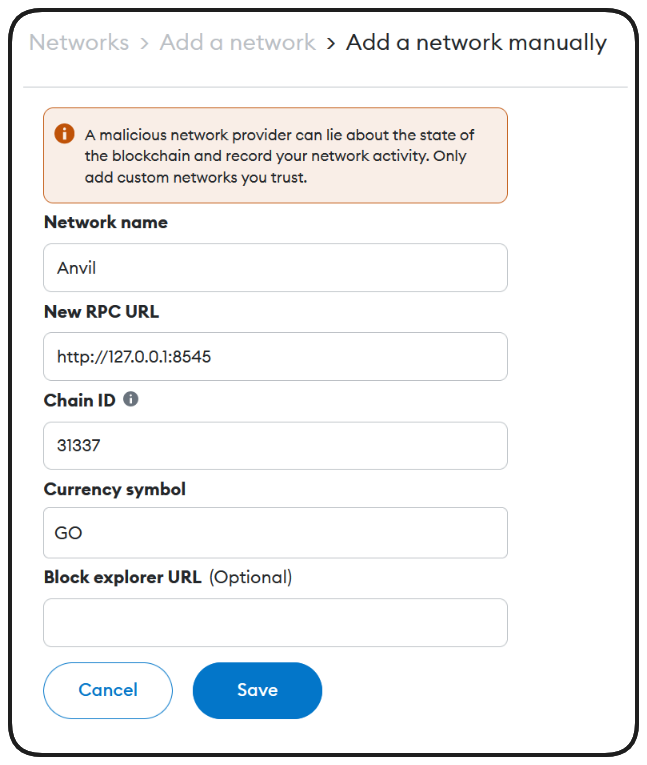
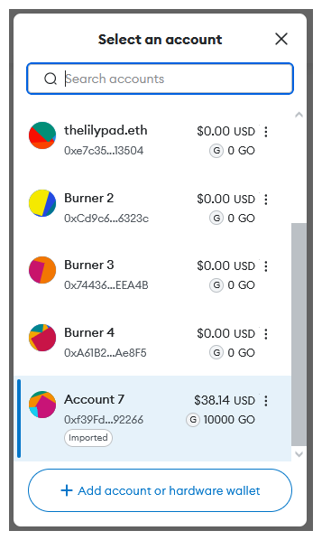
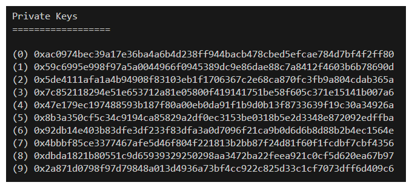
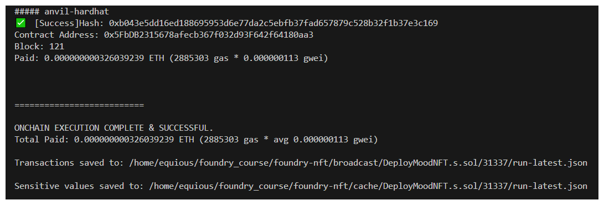
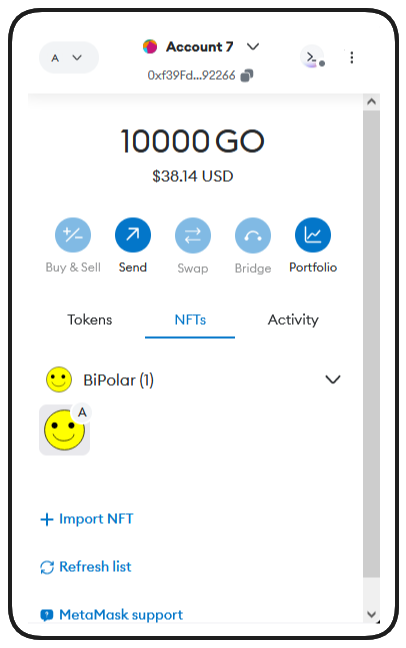
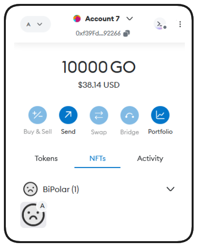

# Deploying BasicNFT on testnet
Make your `.env` and `Makefile` ready to go  
All the detailed code are in Makefile.

1. Deploy:
```bash
make deploy ARGS="--network sepolia"
```
With a contract deployed, this transaction data, including the contract address is added to our `broadcast` folder within run-latest.json. This is how our `DevOpsTool` acquires the most recent contract deployment. We should now be able to use our `BasicNftInteractions.s.sol` script to mint ourselves an NFT.

> ❗ **IMPORTANT**
> Add `fs_permissions = [{ access = "read", path = "./broadcast" }]` to your `foundry.toml` or DevOpsTools won't have the permissions necessary to function correctly! This is more safe than `FFI=true`.

```bash
make mint ARGS="--network sepolia"
```

While this is minting,  
1. Copy the contract address under which the NFT was deployed  (or `broadcast/DeployBasicNft.s.sol/11155111/run-latest.json`).  
2. From MetaMask, go to NFTs and switch to Sepolia.
3. Click on Import NFTs and paste the copied address.
4. Since we're the first to create this NFT, the token ID will be zero. Input this and hit 'Add'.

---

# MoodNft using Svgs fro onchain storage
Let's begin creating our very own dynamic `MoodNFT` with its `SVG` art stored on-chain.

At the core of the NFT we'll build is a `flipMood` function which allows the owner to flip their NFT between happy and sad images.
1. First creat [MoodNft.sol](https://github.com/AkshatOdiya/foundry-nft/blob/main/src/MoodNft.sol)  

> ❗ **IMPORTANT**
> **tokenURI != imageURI**
>
> It's important to remember that imageURI is one property of a token's tokenURI. A tokenURI is usually a JSON object!

At this point you may be asking, if the tokenURI is a JSON object, how do we store this on-chain? The answer: We can encode it in much the same way!

OpenZeppelin actually offers a **[Utilities](https://docs.openzeppelin.com/contracts/4.x/utilities)** package which includes a Base64 function which we can leverage to encode our tokenURI on-chain. 

2. Testing tokenURI  
Given the complexity of our tokenURI function, let's take a moment to write a quick test and assure it's returning what we'd expect it to. Here is the file  [MoodNftTest.t.sol](https://github.com/AkshatOdiya/foundry-nft/blob/main/test/unit/MoodNftTest.t.sol)  

3. [DeployMoodNft.s.sol](https://github.com/AkshatOdiya/foundry-nft/blob/main/script/DeployMoodNft.s.sol)  
This DeployScript uses **[Foundry Cheatcode](https://book.getfoundry.sh/cheatcodes/fs?highlight=readFile#signature)** **[`readFile`](https://book.getfoundry.sh/cheatcodes/fs?highlight=readFile#signature)**  
Before we can allow Foundry to read our files into our deploy script, we'll need to set some permissions in `foundry.toml`. Add this to your `foundry.toml`:
```bash
fs_permissions = [{access = "read", path = "./img/"}]
```
> ❗ **NOTE**
> This line provides the Foundry framework `read` permissions, specifically in the `img` directory. This is much safer than setting `FFI = true`!


4. [DeployMoodNftTest.t.sol](https://github.com/AkshatOdiya/foundry-nft/blob/main/test/unit/DeployMoodNftTest.t.sol)

Remember to classify file into folders like `unit`, `integrations` or `staging` for respective cases.

Here, file that include only main contract file and unit testing are put under `unit` folder and those who include their respective deployer scripts and integrations(or interactions) tests are put under `integrations` folder.

## Deploying SVG NFT on Anvil

Deploying on Anvil because deploying on testnets can be slow and problematic

1. Kick your Anvil chain by writing `anvil` or `make anvil`(as MakeFile says) in terminal
2. Open a new terminal and write `make deployMood`.

Lets make a revisit, how to add anvil chain on metamask.
* Click on `+ Add network`
* Choose to add a network manually and enter the details as shown below:

*  Import an anvil account, In your Metamask account selector, choose `+ add account or hardware wallet`  

  
Select `import account` and enter one of the default private keys offered by the anvil chain.
  

you can run `make deployMood` now


3. Mint the Nft: With the contract address, we should be able to use a cast command to interact with it.
```bash
cast send 0x5FbDB2315678afecb367f032d93F642f64180aa3 "mintNft()" --private-key ac0974bec39a17e36ba4a6b4d238ff944bacb478cbed5efcae784d7bf4f2ff80 --rpc-url http://localhost:8545
```

(We have not made `MoodNftInteractions.s.sol` like `BasicNftInteractions.s.sol` to mint without `cast` but we can use `cast` hehehe!)

When that transaction completes, what we can _finally_ do, is take that contract address, go back into `Metamask > NFTs > Import NFT`. This is going to ask for our contract address, which we have from our deployment, and our tokenId, which is 0.

Once imported ...  



4. If you want to flipMood of Nft
```bash 
cast send 0x5FbDB2315678afecb367f032d93F642f64180aa3 "flipMood(uint256)" 0 --private-key ac0974bec39a17e36ba4a6b4d238ff944bacb478cbed5efcae784d7bf4f2ff80 --
rpc-url http://localhost:8545
```
> ❗ **NOTE**
> For Metamask to reflect the change, we'll regrettably have to remove and readd the NFT collection.

Once we reimport our NFT however...
